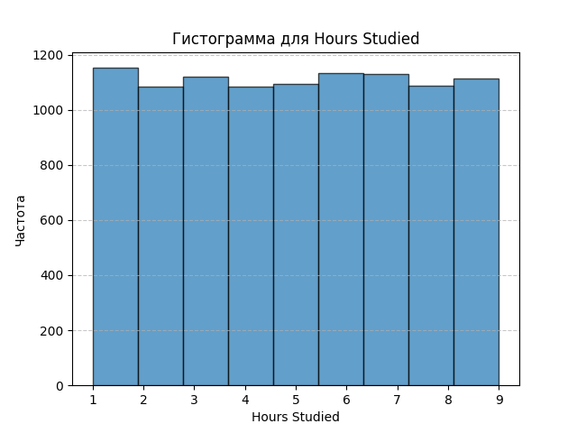
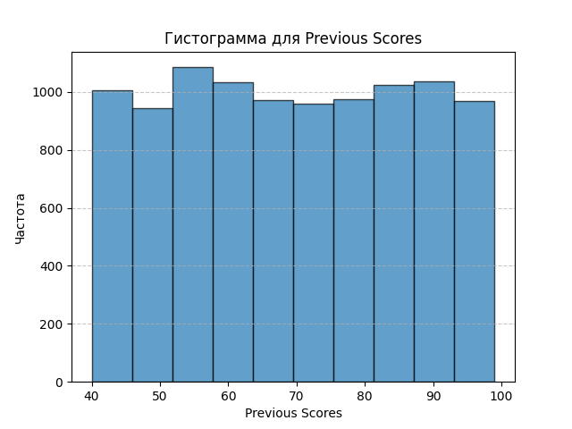
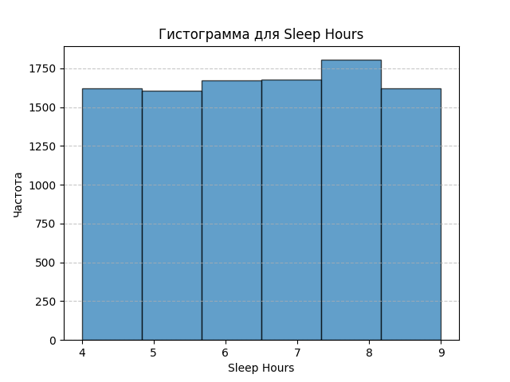
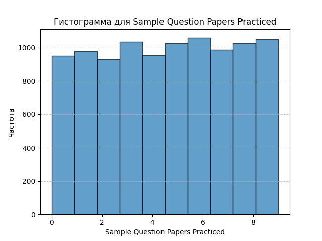
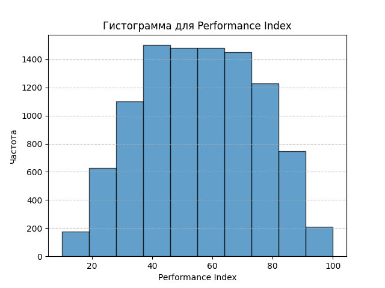
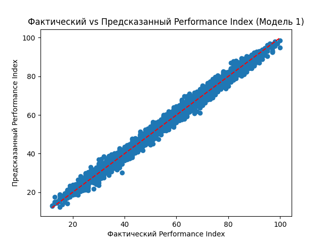

## 1. Загрузка и исследование данных
### 1.1 Загрузка данных

``` python 
data = []
with open('student_performance.csv', 'r') as csvfile:
    csvreader = csv.reader(csvfile)
    headers = next(csvreader)
    for row in csvreader:
        data.append(row)
```

### 1.2. Изучение данных
``` python 
print("Заголовки столбцов:")
print(headers)

print("\nПервые 5 строк данных:")
for row in data[:5]:
    print(row)
```
```
Заголовки столбцов:
['Hours Studied', 'Previous Scores', 'Extracurricular Activities', 'Sleep Hours', 'Sample Question Papers Practiced', 'Performance Index']

Первые 5 строк данных:
['7', '99', 'Yes', '9', '1', '91.0']
['4', '82', 'No', '4', '2', '65.0']
['8', '51', 'Yes', '7', '2', '45.0']
['5', '52', 'Yes', '5', '2', '36.0']
['7', '75', 'No', '8', '5', '66.0']
```

## 2. Статистический анализ
### 2.1. Преобразование данных в нужный формат
``` python
data_dict = {header: [] for header in headers}

for row in data:
    for i, value in enumerate(row):
        data_dict[headers[i]].append(value)
```

### 2.2. Преобразование типов данных
``` python
numeric_columns = ['Hours Studied', 'Previous Scores', 'Sleep Hours', 'Sample Question Papers Practiced', 'Performance Index']

for col in numeric_columns:
    data_dict[col] = [float(x) if x != '' else None for x in data_dict[col]]

categorical_columns = [col for col in headers if col not in numeric_columns]
```

### 2.3. Вычисление статистических показателей
``` python
def compute_statistics(values):
    values = [x for x in values if x is not None]
    count = len(values)
    mean = sum(values) / count
    variance = sum((x - mean) ** 2 for x in values) / count
    std_dev = math.sqrt(variance)
    min_value = min(values)
    max_value = max(values)
    sorted_values = sorted(values)

    def percentile(p):
        k = (count - 1) * p / 100
        f = math.floor(k)
        c = math.ceil(k)
        if f == c:
            return sorted_values[int(k)]
        else:
            return sorted_values[f] * (c - k) + sorted_values[c] * (k - f)

    quantiles = {
        '25%': percentile(25),
        '50%': percentile(50),
        '75%': percentile(75)
    }
    return {
        'count': count,
        'mean': mean,
        'std_dev': std_dev,
        'min': min_value,
        'max': max_value,
        'quantiles': quantiles
    }

statistics = {}
for col in numeric_columns:
    stats = compute_statistics(data_dict[col])
    statistics[col] = stats
    print(f"Статистика для {col}:")
    print(stats)
    print()
```
```
Статистика для Hours Studied:
{'count': 10000, 'mean': 4.9929, 'std_dev': 2.589179327509005, 'min': 1.0, 'max': 9.0, 'quantiles': {'25%': 3.0, '50%': 5.0, '75%': 7.0}}

Статистика для Previous Scores:
{'count': 10000, 'mean': 69.4457, 'std_dev': 17.34228507175449, 'min': 40.0, 'max': 99.0, 'quantiles': {'25%': 54.0, '50%': 69.0, '75%': 85.0}}

Статистика для Sleep Hours:
{'count': 10000, 'mean': 6.5306, 'std_dev': 1.6957781812488417, 'min': 4.0, 'max': 9.0, 'quantiles': {'25%': 5.0, '50%': 7.0, '75%': 8.0}}

Статистика для Sample Question Papers Practiced:
{'count': 10000, 'mean': 4.5833, 'std_dev': 2.867204406734922, 'min': 0.0, 'max': 9.0, 'quantiles': {'25%': 2.0, '50%': 5.0, '75%': 7.0}}

Статистика для Performance Index:
{'count': 10000, 'mean': 55.2248, 'std_dev': 19.21159714755645, 'min': 10.0, 'max': 100.0, 'quantiles': {'25%': 40.0, '50%': 55.0, '75%': 71.0}}
```

### 2.4. Визуализация данных
``` python
for col in numeric_columns:
    values = [x for x in data_dict[col] if x is not None]
    if col == 'Hours Studied':
        bins = 9
    elif col == 'Previous Scores' or col == 'Sample Question Papers Practiced' or col == 'Performance Index':
        bins = 10 
    elif col == 'Sleep Hours':
        bins = 6

    plt.hist(values, bins, edgecolor='black', alpha=0.7)
    plt.title(f'Гистограмма для {col}')
    plt.xlabel(col)
    plt.ylabel('Частота')
    plt.grid(axis='y', linestyle='--', alpha=0.7)
    plt.show()
```






## 3. Предварительная обработка данных
### 3.1. Обработка отсутствующих значений
``` python
for col in numeric_columns:
    values = [x for x in data_dict[col] if x is not None]
    mean_value = sum(values) / len(values)
    data_dict[col] = [x if x is not None else mean_value for x in data_dict[col]]
```

### 3.2. Кодирование категориальных признаков
``` python
data_dict['Extracurricular Activities'] = [1 if x == 'Yes' else 0 for x in data_dict['Extracurricular Activities']]
```

### 3.3. Нормализация данных
``` python
for col in numeric_columns:
    if col != 'Performance Index':
        values = data_dict[col]
        mean = sum(values) / len(values)
        std_dev = math.sqrt(sum((x - mean) ** 2 for x in values) / len(values))
        data_dict[col] = [(x - mean) / std_dev for x in values]
```

## 4. Разделение данных на обучающий и тестовый наборы
``` python
dataset = []
num_samples = len(data_dict['Performance Index'])
for i in range(num_samples):
    record = {col: data_dict[col][i] for col in headers}
    dataset.append(record)

random.shuffle(dataset)

train_size = int(0.7 * num_samples)
train_set = dataset[:train_size]
test_set = dataset[train_size:]
```

# 5. Реализация линейной регрессии методом наименьших квадратов

### 5.1. Подготовка данных для моделей
``` python
def get_features_targets(data, feature_names):
    X = []
    y = []
    for record in data:
        features = [1.0] + [record[feature] for feature in feature_names]
        X.append(features)
        y.append(record['Performance Index'])
    return X, y

for record in train_set + test_set:
    record['Study_Papers_Product'] = record['Hours Studied'] * record['Sample Question Papers Practiced']

features_model1 = ['Hours Studied', 'Previous Scores', 'Extracurricular Activities', 'Sleep Hours', 'Sample Question Papers Practiced']
features_model2 = ['Hours Studied', 'Previous Scores']
features_model3 = ['Hours Studied', 'Sample Question Papers Practiced', 'Study_Papers_Product']
```


### 5.2. Обучение моделей
``` python
def train_linear_regression(X, y):
    X = np.array(X)
    y = np.array(y)
    theta = np.linalg.inv(X.T @ X) @ X.T @ y
    return theta

# Модель 1
X_train1, y_train1 = get_features_targets(train_set, features_model1)
theta1 = train_linear_regression(X_train1, y_train1)

# Модель 2
X_train2, y_train2 = get_features_targets(train_set, features_model2)
theta2 = train_linear_regression(X_train2, y_train2)

# Модель 3
X_train3, y_train3 = get_features_targets(train_set, features_model3)
theta3 = train_linear_regression(X_train3, y_train3)
```

### 5.3. Предсказания
``` python
def predict(X, theta):
    X = np.array(X)
    y_pred = X @ theta
    return y_pred
```

## 6. Оценка моделей
### 6.1. Вычисление коэффициента детерминации
``` python
def compute_r2_score(y_true, y_pred):
    y_mean = sum(y_true) / len(y_true)
    ss_total = sum((y_i - y_mean) ** 2 for y_i in y_true)
    ss_res = sum((y_i - y_hat_i) ** 2 for y_i, y_hat_i in zip(y_true, y_pred))
    r2 = 1 - (ss_res / ss_total)
    return r2

```

### 6.2. Оценка каждой модели
``` python
X_test1, y_test1 = get_features_targets(test_set, features_model1)
y_pred1 = predict(X_test1, theta1)
r2_model1 = compute_r2_score(y_test1, y_pred1)
print(f"R² для Модели 1: {r2_model1:.4f}")

X_test2, y_test2 = get_features_targets(test_set, features_model2)
y_pred2 = predict(X_test2, theta2)
r2_model2 = compute_r2_score(y_test2, y_pred2)
print(f"R² для Модели 2: {r2_model2:.4f}")

X_test3, y_test3 = get_features_targets(test_set, features_model3)
y_pred3 = predict(X_test3, theta3)
r2_model3 = compute_r2_score(y_test3, y_pred3)
print(f"R² для Модели 3: {r2_model3:.4f}")
```
```
R² для Модели 1: 0.9890
R² для Модели 2: 0.9860
R² для Модели 3: 0.1473
```

## 7. Сравнение результатов и выводы
``` python
models_r2 = {
    'Модель 1': r2_model1,
    'Модель 2': r2_model2,
    'Модель 3': r2_model3
}

best_model_name = max(models_r2, key=models_r2.get)
best_r2 = models_r2[best_model_name]
print(f"\nЛучшая модель: {best_model_name} с R² = {best_r2:.4f}")

print("\nВыводы:")
if best_model_name == 'Модель 3':
    print("Введение синтетического признака улучшило производительность модели.")
else:
    print(f"{best_model_name} показала наилучший результат без синтетического признака.")

print("Это указывает на то, что признаки, использованные в этой модели, наиболее значимы для предсказания 'Performance Index'.")
```
```
Выводы:
Модель 1 показала наилучший результат без синтетического признака.
Это указывает на то, что признаки, использованные в этой модели, наиболее значимы для предсказания 'Performance Index'.
```

## 8. Визуализация результатов
``` python
if best_model_name == 'Модель 1':
    y_test = y_test1
    y_pred = y_pred1
elif best_model_name == 'Модель 2':
    y_test = y_test2
    y_pred = y_pred2
else:
    y_test = y_test3
    y_pred = y_pred3

plt.scatter(y_test, y_pred)
plt.xlabel('Фактический Performance Index')
plt.ylabel('Предсказанный Performance Index')
plt.title(f'Фактический vs Предсказанный Performance Index ({best_model_name})')
plt.plot([min(y_test), max(y_test)], [min(y_test), max(y_test)], 'r--')
plt.show()
```

